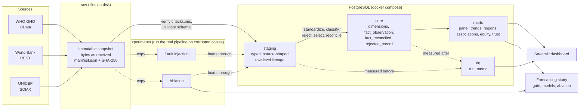

# Architecture

HealthBridge is a batch pipeline that turns three public APIs into one analysis-ready, quality-annotated dataset, with every step measured. This page shows how the parts fit, why they were built that way, and what was deliberately left out. Table-level detail is in the [data dictionary](data_dictionary.md); the rules applied between layers are in [harmonization.md](harmonization.md).

## Data flow

Solid arrows are the production path; dotted arrows are measurement and experiments. The experiments write a corrupted *copy* of a snapshot, then run the unchanged pipeline on it under a separate run identifier and read back what happened to each injected row. They are deleted afterwards (the original data is never modified).

## Layers

| Layer | What it holds | What it guarantees |
|---|---|---|
| `raw` | The API responses byte for byte, plus `manifest.json` (URL, HTTP status, size, SHA-256, scope, package versions, failures) | Nothing is cleaned or reshaped. A snapshot is never overwritten, so any result can name the exact data it used. |
| `staging` | One typed table per source, plus `load_log` | Values are typed, not cleaned. Every row records `run_id`, source file and row number. A snapshot that fails checksum verification is refused. Loading is idempotent and transactional. |
| `core` | Dimensions, `fact_observation` at an explicit grain, `fact_reconciled`, `rejected_record` | Every row is either in the fact table or in `rejected_record` with a reason. Nothing is deleted to force uniqueness. Reconciled values are never averaged. |
| `marts` | Panel with quality tier, latest values, trends, regional summaries, associations, equity gaps, trust scorecard | Built for one snapshot at a time; every value carries its quality tier. |
| `dq` | Metrics per run and stage | The same measurement engine runs on staging and core, so before and after are comparable. |
| `ml` | Empty. | The schema exists but is unused: the forecasting study reads the marts panel and keeps its working data in memory and in result files. |

## Design decisions

| Decision | Alternative considered | Why |
|---|---|---|
| PostgreSQL | Spark, a lakehouse format | The data is about 10^5 rows. Distributed processing would add cost and obscure the logic without any benefit. |
| Plain, versioned, checksummed SQL migrations and transforms | dbt, an ORM | The transformations are a few dozen SQL statements. Editing an applied migration is an error, so schema history is auditable without another tool. |
| Immutable snapshots with manifests | Overwrite in place | Reproducibility and the ability to say which release of the source data a result came from, since estimates are revised between releases. |
| Explicit grain, headline view as the default surface | Deduplicate to one row per country-year | Sources publish sex, wealth and survey breakdowns beside national totals. Deleting them to force uniqueness would hide information; selecting a headline row and keeping the rest is reversible. |
| Source dependence derived from the data | Treat sources as independent | WHO, UNICEF and the World Bank mostly republish the same upstream estimates. Counting their agreement as confirmation would overstate reliability. |
| Reconciliation picks a value, never averages | Mean of sources | An average of one shared estimate and a differently-defined estimate is a number nobody published. Conflicts are flagged and `group_values` keeps each group's value. |
| Fault injection with ground truth | Only report rule-pass rates | Raw source quality is already high, so the interesting question is what the checks catch. Injected faults have known identity, so detection and false alarms can be counted. |
| Pre-registered thresholds for the ML work | Choose after seeing results | The criteria and protocols were committed before the results were generated. Where the data did not support a model, the decision record says so. |
| Streamlit and Altair, headless tests | A separate API and front end | The dashboard is a read-only view of the marts. An API service adds a moving part without a consumer. |
| One Docker image for pipeline and dashboard | Separate images | Same code and dependencies. PostgreSQL stays a separate service with a named volume. |

## Reproducibility

- **Data:** snapshots are named by UTC timestamp and verified against the manifest before loading (`python -m healthbridge.ingest verify`).
- **Code:** each experiment run records the code version; the working tree's untracked files are ignored when computing it.
- **Schema:** versioned migrations; `public.schema_migrations` stores a checksum per migration.
- **Randomness:** fault injection, bootstrap and model seeds are fixed and listed in the reports. Raw experiment output is reproducible from seeds and is not committed.
- **Environment:** `docker compose` for PostgreSQL, the `Dockerfile` for the application, and GitHub Actions running lint and the full test suite against a PostgreSQL service.

## Not built

- **API service.** Planned as optional; no consumer needed it, so it was left out (see the decision table).
- **Workflow orchestration** (Airflow, Dagster, Prefect). Runs are started by command. Orchestration would add scheduling and retries; the analysis here does not need them. A real deployment would.
- **Freshness and drift monitoring** and additional African sources (AfDB, HDX).
- **Subnational and microdata sources** (DHS and similar), excluded for licensing and scope.
